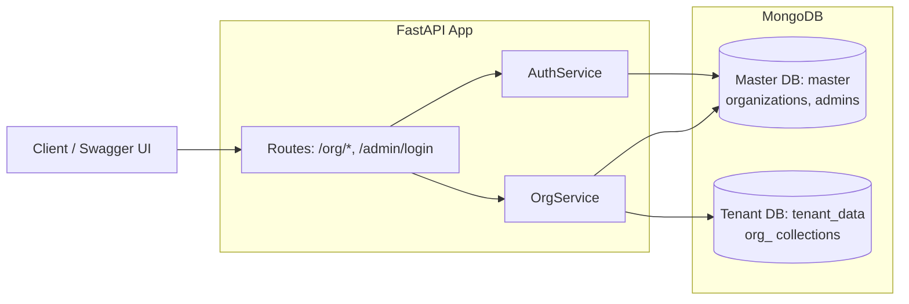

# Multi-Tenant Organization Service (FastAPI + MongoDB)

A backend service that supports creating and managing organizations in a multi-tenant style architecture.

- Master metadata lives in a **Master DB** (`master`)
- Each organization gets its own **dynamic MongoDB collection** in the **Tenant DB** (`tenant_data`) named using: `org_<slug>`

## Tech Stack

- FastAPI
- MongoDB (local Windows service)
- Motor (async Mongo driver)
- JWT auth (python-jose)
- Password hashing (bcrypt via passlib)

## Project Structure

- `app/main.py` - FastAPI app + startup/shutdown hooks
- `app/db/mongo.py` - Mongo connection + master indexes
- `app/core/security.py` - password hashing + JWT encode/decode
- `app/core/tenancy.py` - org slug + collection naming
- `app/services/auth_service.py` - class-based login/auth logic
- `app/services/org_service.py` - class-based org CRUD + tenant collection management
- `app/routes/*` - thin routers calling services

## High-level Architecture



## Environment Variables

- `MONGODB_URI` (default: `mongodb://localhost:27017`)
- `MASTER_DB_NAME` (default: `master`)
- `TENANT_DB_NAME` (default: `tenant_data`)
- `JWT_SECRET_KEY` (default: `change-me`) **set this in real use**
- `JWT_ALGORITHM` (default: `HS256`)
- `ACCESS_TOKEN_EXPIRE_MINUTES` (default: `60`)

## How to Run (Windows)

### 1) Ensure MongoDB is running

MongoDB should be running as a Windows service named `MongoDB`.

### 2) Create venv + install dependencies

```powershell
python -m venv .venv
.\.venv\Scripts\python -m pip install -r requirements.txt
```

### 3) Run the API

```powershell
.\.venv\Scripts\python -m uvicorn app.main:app --host 127.0.0.1 --port 8000
```

Open:

- Home: http://127.0.0.1:8000/
- Swagger docs: http://127.0.0.1:8000/docs

## Public Deployment (Render + MongoDB Atlas)

To make this service accessible to everyone, deploy the API to a public hosting provider and use a managed MongoDB (Atlas).

### 1) Create a MongoDB Atlas cluster

- Create a free cluster in MongoDB Atlas
- Create a database user
- Add an IP allowlist entry
  - For quick testing you can allow `0.0.0.0/0` (not recommended for production)
- Copy your connection string (SRV) and use it as `MONGODB_URI`

Example:

`mongodb+srv://<user>:<password>@<cluster-host>/?retryWrites=true&w=majority`

### 2) Deploy on Render

This repo includes a `Dockerfile` and `render.yaml`.

- Go to Render Dashboard
- New -> Blueprint
- Select this GitHub repository
- Set environment variables:
  - `MONGODB_URI` = your MongoDB Atlas connection string
  - `JWT_SECRET_KEY` = a strong random secret

After deploy, Render will provide a public URL like:

- `https://<your-service>.onrender.com`

Docs will be at:

- `https://<your-service>.onrender.com/docs`

## API Summary

### Create Organization

- `POST /org/create`

Body:

```json
{
  "organization_name": "Acme",
  "email": "admin@acme.com",
  "password": "AdminPass123"
}
```

Behavior:

- Creates `master.organizations` entry
- Creates `master.admins` admin user (bcrypt hash)
- Creates tenant collection `tenant_data.org_acme`

### Admin Login

- `POST /admin/login`

Body:

```json
{
  "email": "admin@acme.com",
  "password": "AdminPass123"
}
```

Returns a JWT: use it as:

- `Authorization: Bearer <token>`

### Get Organization

- `GET /org/get?organization_name=Acme`

### Update Organization

- `PUT /org/update` (requires JWT)

Supports:

- updating admin email/password
- optional rename via `new_organization_name` which creates a new tenant collection and migrates data

### Delete Organization

- `DELETE /org/delete` (requires JWT)

Deletes:

- the org tenant collection
- org admin(s)
- org master metadata

## Design Notes (brief)

- Master data is isolated to a single DB/collection pair for global lookups.
- Tenant data is isolated by collection per org (simple form of multi-tenancy).
- Routers are intentionally thin; business logic is in class-based service modules.
- Passwords are stored only as bcrypt hashes.
- JWT includes `sub` (admin id) and `org_id` so org-scoped authorization is enforceable.
